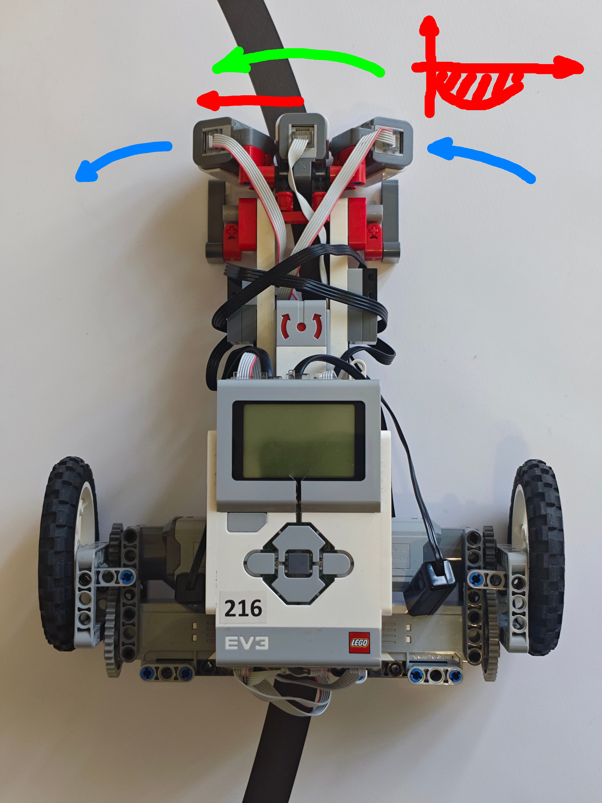

Who are we?
---

##### **two passionate software engineers**
##### *one a bit more senior than the other*

---
Massimiliano
---

##### *things I worked on*
#### telecom switching stations
#### JIT compilers
#### (Mono project, then V8 in Google)
#### gaming engines (Unity 3D)
##### interactive, collaborative VR
#### 🦀 distributed systems and blockchains 🦀
#### 🦀 operational research (vehicle routing) 🦀

---

Michele
---

##### Too many interests to list them!

#### embedded systems
#### sound engineering
#### visualization
##### robotics

##### I just got my Software Engineering degree
##### next one will be the Master's degree

---

🤖 Robotic Competitions as a Hobby 🎉
---


##### ItLUG Robotics Team

---

About this Workshop
---


#### the goal is to learn how to program
##### a line follower robot

##### and what it takes doing it in Rust 🦀

#### high performance robots are expensive
##### so we sill use a simulator

#### the experience will be as close as possible
##### to dealing with a real robot

---

Let's get started!
---

#### clone the repo and build the `sim` app
##### https://github.com/massimiliano-mantione/line-follower-simulator


##### then play with it in `test` mode

---

Build your own Robot!
---

#### you will compile your robot code to WASM
##### so that the simulator can run it

##### open and build the `bot` app

##### customize the configuration

##### load the WASM in the simulator

##### *do not mess with the WASM component definition!*

---

What can the robot do?
---

##### useful functions:

####  `get_time_us`
####  `get_line_sensors`
##### `set_motors_pwm`

#### `wait_remote_enabled`
#### `remote_enabled`
##### `sleep_for`

#### `console_log`

---

Write actual code!
---

##### implement the `run` function

#### a toy robot uses only two sensors
##### ⬅ **left** and **right** ➡

#### if one **side** *senses* the **line**,
##### **turn** that *way*
##### *otherwise*, go **straight**

#### **LET'S SEE**
#### *(load the robot in the runner)*

---

Can we do better?
---

##### this *robot* is **"binary"**
##### it does *not* have **proportional** reactions
##### *how* can we **improve** it?

---

Gradual Steering
---

#### first of all:
##### measure the error

#### find a way, using all the light sensors
##### to measure the distance from the line

<!-- pause -->
##### *(a weighted mean should do the trick)*

<!-- pause -->
#### **EXPERIMENT!**

---

🤖 Use a 🅿 🅸 🅳 Controller 🤖
---

<!-- pause -->
##### What is it?

<!-- pause -->
```
🅿 Proportional
🅸 Integral
🅳 Derivative
```

<!-- pause -->
#### given the error ⓔ
#### *(the distance from the line)*
<!-- pause -->
##### and three constants: `ₖ🄿 ` `ₖ🄸 ` `ₖ🄳 `

<!-- pause -->
##### `turn` = ⓔ ×`ₖ🄿 ` + (∫ⓔ dt)×`ₖ🄸 ` + (dⓔ /dt)×`ₖ🄳 `

<!-- pause -->
#### *this should give **smooth** trajectory control*
##### ***if** the constans are **tuned** properly*

---

🤖 Understanding a 🅿 🅸 🅳 Controller 🤖
---

<!-- column_layout: [1, 1] -->
<!-- column: 0 -->

<!-- column: 1 -->
##### *proportional*

<!-- pause -->
#### 🔵
##### robot speed

<!-- pause -->
#### 🔴
##### distance from line

<!-- pause -->
#### 🟢
##### desired turn

##### `turn` = ⓔ ×`ₖ🄿 `

---

🤖 Understanding a 🅿 🅸 🅳 Controller 🤖
---

<!-- column_layout: [1, 1] -->
<!-- column: 0 -->

<!-- column: 1 -->
##### *derivative*

<!-- pause -->
#### 🔵
##### robot rotation

<!-- pause -->
#### 🔴
##### apparent line side speed

<!-- pause -->
#### 🟢
##### desired compensation

##### `turn` = (dⓔ /dt)×`ₖ🄳 `

---

🤖 Understanding a 🅿 🅸 🅳 Controller 🤖
---

<!-- column_layout: [1, 1] -->
<!-- column: 0 -->

<!-- column: 1 -->
##### *integral*

<!-- pause -->
#### 🔵
##### robot rotation

<!-- pause -->
#### 🔴
##### line distance over time

<!-- pause -->
#### 🟢
##### desired turn

##### `turn` = (∫ⓔ dt)×`ₖ🄸 `

---

🤖 Understanding a 🅿 🅸 🅳 Controller 🤖
---

<!-- column_layout: [1, 1, 1] -->
<!-- column: 0 -->
##### *proportional*
##### `turn` = ⓔ ×`ₖ🄿 `

#### *considers*
#### **now**
<!-- column: 1 -->
##### *derivative*
##### `turn` = (dⓔ /dt)×`ₖ🄳 `

#### *predicts*
#### the **future**
<!-- column: 2 -->
##### *integral*
##### `turn` = (∫ⓔ dt)×`ₖ🄸 `

#### takes the **past**
#### into *account*

---

EXPERIMENT
---

##### implement a PID

##### and make it RUN!

---

Going Out
---

##### *...what if...*

#### you robot goes **out** and
##### soed **not** *sense* the line?

#### **90°** turns are the **bane**
##### of *all* line *followers*!

##### let's find a solution!

---

Can we go faster?
---

##### in principle, yes

##### we can try!

##### the robot will fail in misterious ways

##### how can we understand why?

---

🤖 Hard Real Time 🤖
---

<!-- pause -->
##### the **PID** runs in an *event loop*
<!-- pause -->
##### a *late* result is a **wrong** result
<!-- pause -->
##### 🤔 how *fast* is **fast enough?** 🤔
<!-- pause -->
#### ⛔ *not* ⛔
##### as *fast* as **possible**
<!-- pause -->
#### ✅ *but* ✅
##### as *fast* as **needed**

---

Line Follower Latency
---


<!-- pause -->
#### bot speed:
#### 1.0㎧: 2㎳ ➡ 2㎜
#### 1.5㎧: 2㎳ ➡ 3㎜
##### 2.0㎧: 2㎳ ➡ 4㎜

<!-- pause -->
#### line *width*: **20㎜**
#### max *sensing period*: about **4㎳**

---

More about our simulator
---

#### the *simulation* runs with a **fixed period**
#### chosen *between 1000µs (1㎑) and 100µs (10㎑)*
##### the *default* period is **500µs**

#### time is measured by *WASM* **fuel** consumption
##### *each instruction takes 50ns (20㎒ clock)*

##### *physics* and *CPU* time are **synchronized**

##### the simulation runs as a batch job

##### the visualization is like a video recorder


---

Ok... but can our bot go faster?
---

##### yes, but things will go wrong

#### filming the robot is not enough
##### real time logging is not feasible

<!-- pause -->
##### to understand problems, we need...

<!-- pause -->
##### **TELEMETRY!**

---

What Do We Need?
---

##### things we would like to inspect:

#### timestamps
#### line sensor values
#### line error
#### error derivative
#### left and right PWM
##### out condition direction

#### *a few tens of bytes*

---

The Telemetry Challenge
---

<!-- pause -->
#### we want to *see* **every** decision **taken**
##### *(let's say a 20 bytes sample)*
<!-- pause -->
##### potentially at a **2㎑** rate
<!-- pause -->
##### transmitting **20 KB/s** over **BT** serial
<!-- pause -->
##### *while* the robot *runs*
<!-- pause -->
##### ⛔ **NO WAY** ⛔

---

Offline Telemetry
---

<!-- pause -->
##### **10k** samples take about **200 KB** of **RAM**
<!-- pause -->
#### at **0.5㎑** they cover **20s**
##### *this is more than enough!*

<!-- pause -->
#### **push** each *sample to a *ring buffer* while the robot **runs**
##### **save** the *data file* when the race **stops**

<!-- pause -->
##### *(reducing sample rate covers more time)*

---

Telemetry Result
---


---

API for Arduino-style Coding
---

<!-- pause -->
##### *full* logic in a **single** *event* **loop**

<!-- pause -->
```rust {1,5|2|3|4|all}
loop {
    read_sensors()
    compute_something()
    apply_results()
}
```
<!-- pause -->
##### 🤔 *what's **wrong** with it?* 🤔

<!-- pause -->
##### **nothing!** *but...*

---

The Need for `async`
---

##### CONCURRENT SENSOR READS

##### sensors *read* rate **mismatches**
#### analog pin:  **100µs**
#### Ultrasound: **20㎳**
##### RGB color:  **1㎳**

##### on different `BUS`ses

#### a logic *loop* should read **concurrently**

---

The Need for `async`
---

##### CONCURRENT LOGIC

#### robot *logic* can be composed of
#### different **concurrent** state machines
##### *(different **tasks** progressing at different **rates**)*

#### process **line error**
##### *(dⓔ /dt, ∫ⓔ dt, filtering)*

#### process **motor status**
##### *(compute actual wheels speed)*

##### run **driving logic**

##### collect **telemetry**

<!-- pause -->
##### handle **timeout** and **remote control**

---

💡 The Solution: an `async` Runtime 💡
---

##### implement functionality with tasks

##### each task is an `async` function

#### **compose** tasks with *usual combinators*
##### *(`zip` or `join`, `race`...)*

#### tasks can communicate with
##### **streams** and **channels**

##### **Let's see!**

---

🤖 A Better Control Algorithm 🤖
---

<!-- pause -->
#### tuning 🅿 🅸 🅳 parameters
##### can be *very* **confusing**

<!-- pause -->
#### their *intuitive* meaning
##### is **not** *difficult*

<!-- pause -->
#### but their **actual** *values*
##### can be **elusive**

<!-- pause -->
##### 🤔 *is there a better way?* 🤔

---

🤖 Tuning Error Compensation 🤖
---

<!-- column_layout: [1, 1] -->
<!-- column: 0 -->

<!-- column: 1 -->

##### *tuning* `ₖ🄿 `

<!-- pause -->
#### 🔴
##### distance from line

<!-- pause -->
#### 🔵
##### robot direction

<!-- pause -->
#### 🟢
##### desired direction

#### the **desired** *direction* is
##### **parallel** to the *line*


---

🤖 Tuning for Zero Rotation 🤖
---

<!-- column_layout: [1, 1] -->
<!-- column: 0 -->

<!-- column: 1 -->

##### *tuning* `ₖ🄳 `

<!-- pause -->
#### 🔵
##### robot rotation speed

<!-- pause -->
#### 🔴
##### apparent line side speed

<!-- pause -->
#### 🟢
##### desired compensation

#### the **desired** *rotation*
#### *speed* is **zero**
#### *(a **gyro** can be useful!)*

---

🤖 Tuning for Smooth Turns 🤖
---

<!-- column_layout: [1, 1] -->
<!-- column: 0 -->

<!-- column: 1 -->

##### *finely tuning* `ₖ🄳 `

<!-- pause -->
##### consider *rotation speeds:*

<!-- pause -->
#### 🔵
#### **actual** rotation speed **`RS`**
##### *taken from gyro or from wheels speeds*

<!-- pause -->
#### 🔴
#### **apparent** rotation speed **`LS`**
##### *from line side speed (dⓔ /dt)*

<!-- pause -->
#### 🟢
#### the **desired** rotation *speed* is
##### **`RS` - `LS`**


---

RACING TIME
---


```
 _    ____  ___. ____
 |    |___  |  ' [__
 |___ |___  |    ___]

 _  _ ____ _  _ ____    ____ _  _ _  _   /
 |__| |__| |  | |___    |___ |  | |\ |  /
 |  | |  |  \/  |___    |    |__| | \| .

```

---

A Quick Recap
---

<!-- pause -->
##### we have seen...

<!-- pause -->
##### **line** *followers* and **PID** *controllers*

<!-- pause -->
##### using and *embedded* `async` runtime

<!-- pause -->
##### a *minimal* and *efficient* **telemetry** system

<!-- pause -->
##### **advanced** line follower **algorithms**

---

🚧 IMPORTANT NOTICE 🚧
---

<!-- pause -->
#### no 🦀 crab 🦀 was *harmed*
##### in the *production* of this workshop

<!-- pause -->
##### but **several** were put to *good* **use**

<!-- pause -->
#### 📰 Zed 📰
#### 🎮 Bevy 🎮
#### 💪 Rapier 💪
#### 📊 presenterm 📊
#### 💻 **WEZ** terminal 💻
##### 🌠 **Cosmic** desktop 🌠

<!-- pause -->
##### 🙏 **thanks to the community** 🙏

<!-- pause -->
##### 🦀 *the **Rust** ecosystem is **amazing*** 🦀

---

Finally...
---

```

 ████████╗██╗  ██╗ █████╗ ███╗   ██╗██╗  ██╗███████╗██╗
 ╚══██╔══╝██║  ██║██╔══██╗████╗  ██║██║ ██╔╝██╔════╝██║
    ██║   ███████║███████║██╔██╗ ██║█████╔╝ ███████╗██║
    ██║   ██╔══██║██╔══██║██║╚██╗██║██╔═██╗ ╚════██║╚═╝
    ██║   ██║  ██║██║  ██║██║ ╚████║██║  ██╗███████║██╗
    ╚═╝   ╚═╝  ╚═╝╚═╝  ╚═╝╚═╝  ╚═══╝╚═╝  ╚═╝╚══════╝╚═╝

```


#### https://github.com/massimiliano-mantione/line-follower-simulator
